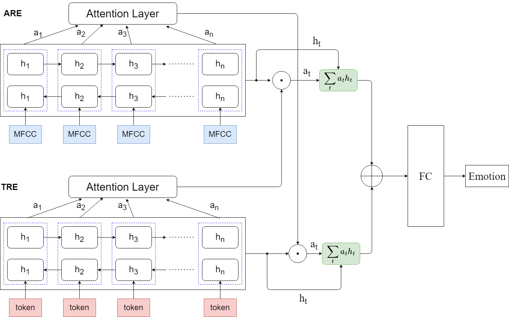

# Multimodal emotion recognition using Pytroch

A pytorch implementation of the paper  
Multimodal Speech Emotion Recognition using Audio and Text (https://arxiv.org/pdf/1810.04635.pdf)
  
# Model

## Dataset
        IEMOCAP
## Preprocessing
        read the file ./dataset/readme.md
## Requirement
        python 3.6.13
        pytorch 1.10.1
        librosa 0.9.2
        transformers 4.18.0
        tensorboard 2.10.1
## Training
        bash run.sh
## Evaluation
        "summary" will store tensorboard log.
        tensorboard --logdir=summary
